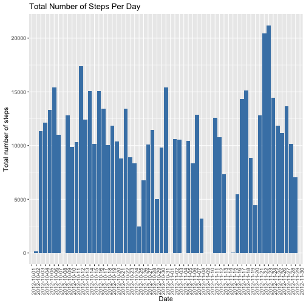
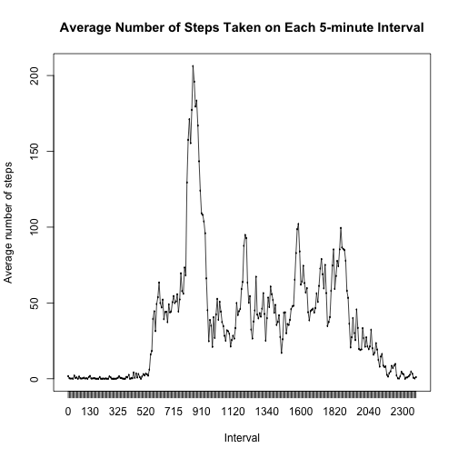
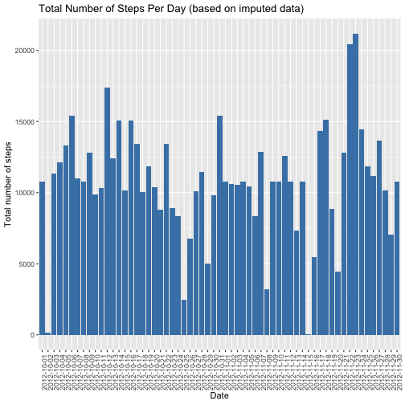
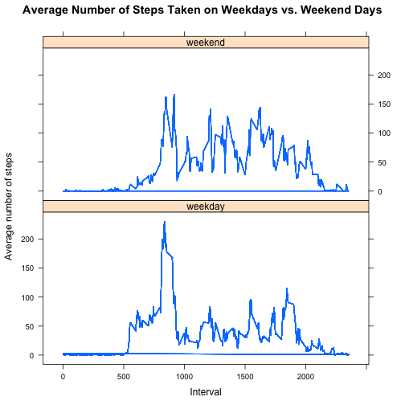

Reproducible Research. Course Project 1
=======================================

The following report answers questions related to data from a personal activity monitoring device.
The original dataset can also be found in the same GitHub repository.

### Loading the data


```r
activity <- read.csv("activity.csv")
```

### What is the mean total number of steps taken per day?

The total number of steps taken by the subject, per day, is:

```r
stepsperday <- with(activity, tapply(steps, date, sum))
stepsperday
```

```
## 2012-10-01 2012-10-02 2012-10-03 2012-10-04 2012-10-05 2012-10-06 
##         NA        126      11352      12116      13294      15420 
## 2012-10-07 2012-10-08 2012-10-09 2012-10-10 2012-10-11 2012-10-12 
##      11015         NA      12811       9900      10304      17382 
## 2012-10-13 2012-10-14 2012-10-15 2012-10-16 2012-10-17 2012-10-18 
##      12426      15098      10139      15084      13452      10056 
## 2012-10-19 2012-10-20 2012-10-21 2012-10-22 2012-10-23 2012-10-24 
##      11829      10395       8821      13460       8918       8355 
## 2012-10-25 2012-10-26 2012-10-27 2012-10-28 2012-10-29 2012-10-30 
##       2492       6778      10119      11458       5018       9819 
## 2012-10-31 2012-11-01 2012-11-02 2012-11-03 2012-11-04 2012-11-05 
##      15414         NA      10600      10571         NA      10439 
## 2012-11-06 2012-11-07 2012-11-08 2012-11-09 2012-11-10 2012-11-11 
##       8334      12883       3219         NA         NA      12608 
## 2012-11-12 2012-11-13 2012-11-14 2012-11-15 2012-11-16 2012-11-17 
##      10765       7336         NA         41       5441      14339 
## 2012-11-18 2012-11-19 2012-11-20 2012-11-21 2012-11-22 2012-11-23 
##      15110       8841       4472      12787      20427      21194 
## 2012-11-24 2012-11-25 2012-11-26 2012-11-27 2012-11-28 2012-11-29 
##      14478      11834      11162      13646      10183       7047 
## 2012-11-30 
##         NA
```

A histogram of the total number of steps taken each day can be found below. It uses the averaged
data that has been computed in the call to *tapply* in the previous chunk. Since there are missing
values in the dataset, the call to *ggplot* produces a warning.

```r
steps <- data.frame(steps = stepsperday, date = names(stepsperday))
library(ggplot2)
ggplot(steps, aes(x = date, y = steps)) +
    geom_histogram(stat = "identity", fill = "steelblue") +
    theme(axis.text.x = element_text(angle = 90, hjust = 1)) +
    xlab("Date") +
    ylab("Total number of steps") +
    ggtitle("Total Number of Steps Per Day")
```

```
## Warning: Ignoring unknown parameters: binwidth, bins, pad
```

```
## Warning: Removed 8 rows containing missing values (position_stack).
```



The mean and median of the total number of steps taken per day are:

```r
mean(steps$steps, na.rm = TRUE)
```

```
## [1] 10766.19
```

```r
median(steps$steps, na.rm = TRUE)
```

```
## [1] 10765
```

### What is the average daily activity pattern?

The following code chunk produces a times series plot of the 5-minute interval (x-axis) 
and the average number of steps taken, averaged across all days (y-axis). Mean step values have been
computed in the call to *tapply*, and the *interval* variable has been converted to factor so as to
preserve the order of its values in the plot.

```r
stepsperinterval <- with(activity, tapply(steps, interval, mean, na.rm = TRUE))
stepsint <- data.frame(steps = stepsperinterval, interval = names(stepsperinterval))
stepsint$interval <- factor(stepsint$interval, levels=unique(stepsint$interval)) 

plot(stepsint$interval, stepsint$steps, xlab = "Interval", ylab = "Average number of steps",
     main = "Average Number of Steps Taken on Each 5-minute Interval")
points(stepsint$interval, stepsint$steps, type = "l")
```




```r
max(stepsperinterval)
```

```
## [1] 206.1698
```
On average across all the days in the dataset, the maximum number of steps was taken in the 915
interval: 206 steps. This interval roughly corresponds to 3.30pm.

### Imputing missing values


```r
sum(complete.cases(activity))
```

```
## [1] 15264
```

```r
sum(is.na(activity$steps))
```

```
## [1] 2304
```
15264 cases are complete, meaning that there are 2304 rows with NA values. We can also see that
all of these missing values are in the *steps* variable.

I have imputed the missing values based on the mean for each 5-minute interval (calculated above) and created a new dataset, equal to the original one but with the NAs filled in. Following is the corresponding code:

```r
activity_full <- data.frame(steps = activity$steps,
                            date = activity$date,
                            interval = activity$interval,
                            steps_intavg = rep(stepsint$steps, 61))

activity_imputed <- transform(activity_full, steps = ifelse(is.na(steps), steps_intavg, steps))
```

Below is a histogram of the total number of steps taken each day, using the dataset with imputed values. The chunk also includes the necessary code for computing the total number of steps per day.

```r
stepsperday_imputed <- with(activity_imputed, tapply(steps, date, sum))
steps_imputed <- data.frame(steps = stepsperday_imputed, 
                            date = names(stepsperday_imputed))

ggplot(steps_imputed, aes(x = date, y = steps)) +
    geom_histogram(stat = "identity", fill = "steelblue") +
    theme(axis.text.x = element_text(angle = 90, hjust = 1)) +
    xlab("Date") +
    ylab("Total number of steps") +
    ggtitle("Total Number of Steps Per Day (based on imputed data)")
```

```
## Warning: Ignoring unknown parameters: binwidth, bins, pad
```



Mean and median total number of steps taken per day:

```r
mean(steps_imputed$steps)
```

```
## [1] 10766.19
```

```r
median(steps_imputed$steps)
```

```
## [1] 10766.19
```
We can see how imputing missing data did not produce any significant changes in the estimates of the total number of steps taken each day. The mean is identical to that in the original data, while in the median there is only a difference of about one step per day. This was to be expected, since the imputed values have themselves been calculated based on the mean for each 5-minute interval, therefore not producing any deviation.

### Are there differences in activity patterns between weekdays and weekends?

The following code chunk created a new factor variable indicating whether a given date is a weekday or a weekend day.

```r
activity_imputed$date <- as.POSIXct(strptime(activity_imputed$date, format = "%Y-%m-%d"))
activity_imputed$day <- weekdays(activity_imputed$date, abbreviate = TRUE)
library(dplyr)
```

```
## 
## Attaching package: 'dplyr'
```

```
## The following objects are masked from 'package:stats':
## 
##     filter, lag
```

```
## The following objects are masked from 'package:base':
## 
##     intersect, setdiff, setequal, union
```

```r
activity_imputed <- mutate(activity_imputed, daytype = ifelse(day %in% c("Mon", "Tue", "Wed", "Thu", "Fri"),
                                   "weekday", "weekend"))
```

Then step averages have been calculated, by 5-minute interval, separately for weekdays and weekend days,
then merged again in one dataset.

```r
week <- subset(activity_imputed, daytype == "weekday")
week_intavg <- with(week, tapply(steps, interval, mean))
week$steps_intavg_bydaytype <- rep(week_intavg, 45)


weekend <- subset(activity_imputed, daytype == "weekend")
weekend_intavg <- with(weekend, tapply(steps, interval, mean))
weekend$steps_intavg_bydaytype <- rep(weekend_intavg, 16)

activity_bydaytype <- rbind(week, weekend)
```

Below is a panel, time series plot of the 5-minute interval and the average number of steps taken, averaged across all weekdays or weekend days.

```r
library(lattice)
xyplot(steps_intavg_bydaytype ~ interval | daytype, activity_bydaytype, 
       type = "l", layout = c(1, 2), xlab = "Interval", ylab = "Average number of steps",
       main = "Average Number of Steps Taken on Weekdays vs. Weekend Days")
```



